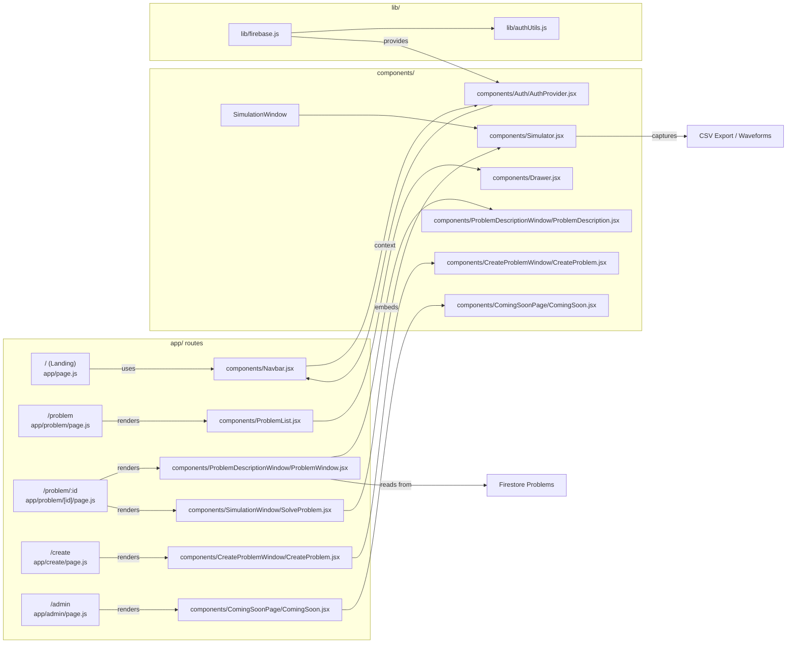

# Ohmify Route & Component Map

#### Mermaid diagram

```mermaid
flowchart LR
  subgraph App_Routes[app/ routes]
    A["/ (Landing)<br/>app/page.js"] -->|uses| Navbar[components/Navbar.jsx]
    B["/problem<br/>app/problem/page.js"] -->|renders| ProblemList[components/ProblemList.jsx]
    C["/problem/:id<br/>app/problem/[id]/page.js"] -->|renders| ProblemWindow[components/ProblemDescriptionWindow/ProblemWindow.jsx]
    C -->|renders| SolveProblem[components/SimulationWindow/SolveProblem.jsx]
    D["/create<br/>app/create/page.js"] -->|renders| CreateProblem[components/CreateProblemWindow/CreateProblem.jsx]
    E["/admin<br/>app/admin/page.js"] -->|renders| ComingSoon[components/ComingSoonPage/ComingSoon.jsx]
  end

  subgraph Components[components/]
    Navbar --> AuthProvider[components/Auth/AuthProvider.jsx]
    ProblemList --> Drawer[components/Drawer.jsx]
    ProblemWindow --> ProblemDescription[components/ProblemDescriptionWindow/ProblemDescription.jsx]
    SimulationWindow --> Simulator[components/Simulator.jsx]
    CreateProblem --> CreateProblemWindow[components/CreateProblemWindow/CreateProblem.jsx]
    ComingSoon --> ComingSoonPage[components/ComingSoonPage/ComingSoon.jsx]
  end

  subgraph Lib[lib/]
    Firebase[lib/firebase.js] --> AuthUtils[lib/authUtils.js]
  end

  Firebase -->|provides| AuthProvider
  AuthProvider -->|context| Navbar
  ProblemWindow -->|reads from| Firestore[Firestore Problems]
  SolveProblem -->|embeds| Simulator
  Simulator -->|captures| CSVExport[CSV Export / Waveforms]
```